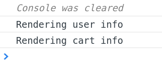
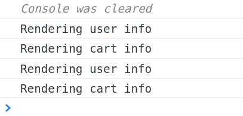
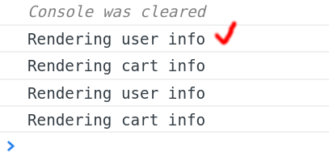
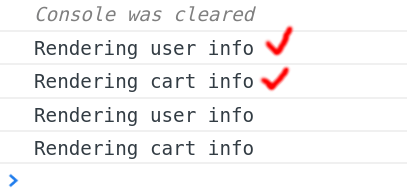
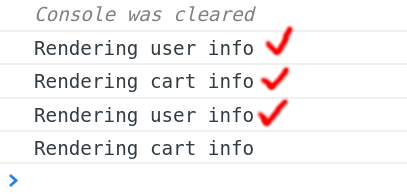
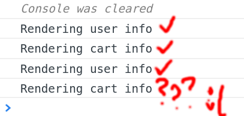
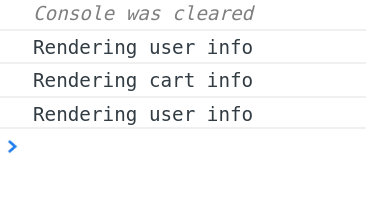

import { Head, Code, Appear, components as Components } from 'mdx-deck';
import { FullscreenCode, Split, SplitRight } from 'mdx-deck/layouts'
import TypescriptCode from './components/typescript-code';

export { default as theme } from './theme';

import { state } from './src/state';

<Head>
  <title>Reselect</title>
</Head>

# How to `reselect`

#### A simple guide by Grzegorz Rozdzialik

---

## Problem

---

export default Split

import StateSample from 'raw-loader!./src/state.sample.ts';

<TypescriptCode>{StateSample}</TypescriptCode>

### Application state

Tasks:

<ul>
<Appear>
  <li>extract
    {' '}<Components.inlineCode>user</Components.inlineCode>{' '}
    and
    {' '}<Components.inlineCode>cart.items</Components.inlineCode>
  </li>
  <li>render them to the screen</li>
</Appear>
</ul>

---

import NaiveSelectors from 'raw-loader!./src/naive-selectors.sample.ts';

### Extractors

<TypescriptCode>{NaiveSelectors}</TypescriptCode>

---

## Components

---

### UserInfo

import UserInfoSample from 'raw-loader!./src/components/user-info.sample.tsx';

<TypescriptCode>{UserInfoSample}</TypescriptCode>

---

import UserInfo from './src/components/user-info';

```jsx
const userName = extractUserName(state);
<UserInfo userName={userName} />
```

<UserInfo userName={state.user.name} />

---

### CartInfo

import CartInfoSample from 'raw-loader!./src/components/cart-info.sample.tsx';

<TypescriptCode>{CartInfoSample}</TypescriptCode>

---

import CartInfo from './src/components/cart-info';

```jsx
const cart = extractCart(state);
<CartInfo cart={cart} />
```

<CartInfo cart={state.cart} />

---

### Info = UserInfo + CardInfo

```tsx
import { CartInfoProps, CartInfo } from './cart-info';
import { UserInfoProps, UserInfo } from './user-info';

type InfoProps = CartInfoProps & UserInfoProps;

export const Info: StatelessComponent<InfoProps> = ({ cart, userName }) => (
  <React.Fragment>
    <UserInfo userName={userName} />
    <CartInfo cart={cart} />
  </React.Fragment>
);
```

---


export default Split

```jsx
// in app.tsx

const userName = extractUserName(state);
const cart = extractCart(state);

return <Info userName={userName} cart={cart} />;
```

<UserInfo userName={state.user.name} />
<CartInfo cart={state.cart} />

---


---

## Performance?


```notes
Czy komponenty renderują się tylko wtedy, gdy dane się zmieniły?
```

---

import CartInfoLogSample from 'raw-loader!./src/components/cart-info-log.sample.tsx';

<TypescriptCode>{CartInfoLogSample}</TypescriptCode>

---

import UserInfoLogSample from 'raw-loader!./src/components/user-info-log.sample.tsx';

<TypescriptCode>{UserInfoLogSample}</TypescriptCode>

---



---


---

Let's simulate changing the state (in `app.tsx`)

```tsx
componentDidMount() {
  // Simulates changing the state
  setTimeout(() => {
    this.setState({
      user: {
        ...this.state.uesr,
        name: 'Not Grzenio',
      },
    });
  }, 2000);
}
```

---



---



---



---



---



---


---

## Solution 1

`StatelessComponent` -> `PureComponent`

---

```tsx
export class UserInfo extends PureComponent<UserInfoProps> {
  public render() {
    console.log('Rendering user info');

    return <div>Hello, {this.props.userName}!</div>;
  }
}
```

---

## Result



---


---

## But still...

```tsx
const extractCart = (state: State) => state.cart;
const extractCartItems = (state: State) => extractCart(state).items;
```

`cart` did not change

`extractCartItems` is executed again anyway

---


---

## Can we do better?

---

## Solution 2

`reselect`

---

### Building block - selector

```tsx
export type Selector<S, R> = (state: S) => R;
```

---

### Basic selector

```tsx
const stateSelector: Selector<State, State> = (state) => state;
```

---

### Composing selectors

```tsx
const userSelector = createSelector(
  stateSelector,
  (state) => state.user,
);

// userSelector: (state: State) => User
```

---

```tsx
const userNameSelector = createSelector(
  userSelector,
  (user) => user.name,
);

// userNameSelector: (state: State) => string
```

```notes
The parameter is still `state`.
```

---

### Similar selectors for `cart`

```tsx
const cartSelector = createSelector(
  stateSelector,
  (state) => state.cart,
);

const cartItemsSelector = createSelector(
  cartSelector,
  (cart) => cart.items,
);
```

---

### Usage

```tsx
// app.tsx

const userName = userNameSelector(state);
const cart = cartSelector(state);

return <Info userName={userName} cart={cart} />;
```

---

### Benefits

1. Easy selector composition
2. Selectors are not recomputed when it is not needed

```tsx
const userSelector = createSelector(
  stateSelector,
  (state) => state.user,
);

const userNameSelector = createSelector(
  userSelector,
  (user) => user.name,  // <- this function will not run if `user` did not change
);
```

---

### Combining multiple selectors

```tsx
const totallyUnnecessarySelectors = createSelector(
  userNameSelector,
  cartSelector,
  (userName, cart) => `${userName}'s store updated at ${cart.updatedAt}`,
);
```

---

### Parametrizing selectors

```tsx
const cartItemSelector = (itemName: string) =>
  createSelector(cartItemsSelector, (cartItems) =>
    cartItems.find((item) => item.name === itemName),
  );

// usage:
cartItemSelector('Pen')(state)
```

---

### Parametrized selectors in `mapStateToProps`

```tsx
interface SomeComponentsProps {
  item: CartItem;
}

const mapStateToProps: MapStateToProps<SomeComponentsProps, null, State> = (
  state,
) => {
  return {
    item: cartItemSelector('Pen')(state),
  };
};

export default connect(mapStateToProps)(SomeComponent);
```

---


---

### But why?

```tsx
const mapStateToProps: MapStateToProps<SomeComponentsProps, null, State> = (
  state,
) => {
  const selector = cartItemSelector('Pen'); // creates new selectors each time

  return {
    item: selector(state),
  };
};

export default connect(mapStateToProps)(SomeComponent);
```

---

### The proper way

```tsx
const mapStateToPropsFactory: MapStateToPropsFactory<
  SomeComponentsProps,
  null,
  State
> = () => {
  // selector is created only once
  const selector = cartItemSelector('Pen');

  return (state) => ({
    item: selector(state),
  });
};

export default connect(mapStateToPropsFactory)(SomeComponent);
```

---


---

### Structured selectors

```tsx
const mapStateToProps = createStructuredSelector({
  item: cartItemSelector('Pen'),
});

export default connect(mapStateToProps)(SomeComponent);
```

---

## Conclusion

---

`reselect` provides

<ol>
  <Appear>
    <li>Selector composition</li>
    <li>Memoization</li>
    <li>Performance</li>
    <li>Nice type inference</li>
  </Appear>
</ol>

---

### More info

[https://github.com/reduxjs/reselect](https://github.com/reduxjs/reselect)


### Commonly used selectors

`app/fabric/resources/entities/selectors.ts`

(and many other files that use selectors)

---


---

## Questions?